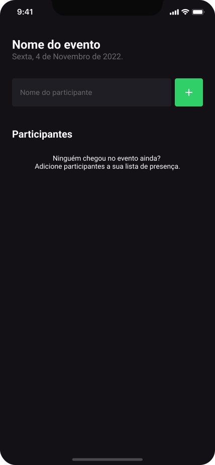
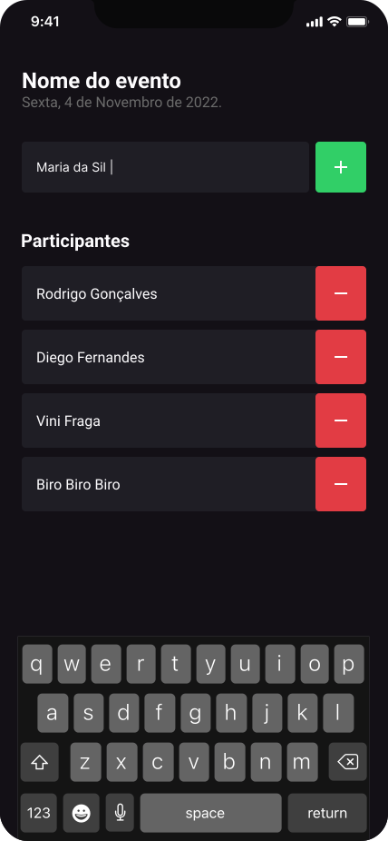
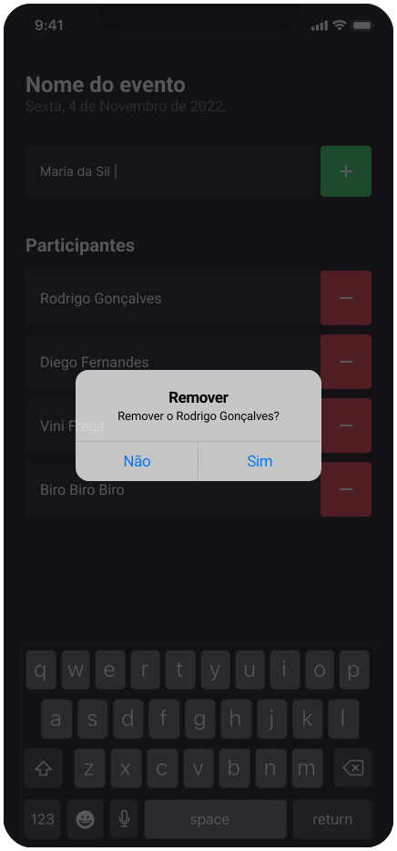

<h1 align="center">
  ImHere - React Native
</h1>

## 🔖 About

O IamHere é um aplicativo desenvolvido em React Native, utilizando a biblioteca Expo, com o propósito de oferecer uma solução eficiente e intuitiva para gerenciar a lista de participantes de eventos.

A interface do aplicativo apresenta um campo de entrada de texto onde os usuários podem inserir o nome do participante a ser adicionado à lista. Ao clicar no botão "+", o participante é incluído na lista exibida na tela principal.

Para proporcionar uma visualização organizada e eficiente, os participantes são exibidos em uma FlatList. Cada item da lista exibe o nome do participante adicionado. Além disso, a lista é atualizada em tempo real conforme os usuários adicionam ou removem participantes.

Uma funcionalidade chave do aplicativo é a capacidade dos usuários de remover participantes da lista. Isso é feito ao tocar no botão de remoção associado a cada item da FlatList. Essa característica possibilita uma gestão flexível da lista, permitindo que os usuários eliminem participantes que não são mais relevantes.

## 🔖 Image

<h1 align="center">
  <div style="display: flex; flex-direction: row; align: center;" align="center">
    
    
    
  <div>
</h1>

## 🚀 Technologies

- [ReactNative](https://reactnative.dev/)
- [Typescript](https://www.typescriptlang.org/)
- [Expo](https://expo.dev/)

## 🏁 How to run the project

```sh
# Clone the repository
git clone https://github.com/Agotsilv/imhere.git
cd imhere

# Install the dependencies
npm install

# Start the Android application
npx expo start

```

#### Contato

[](https://www.linkedin.com/in/agotsilva/)
[](mailto:ago.tsilva@gmail.com)

**Free Software, Hell Yeah!**
